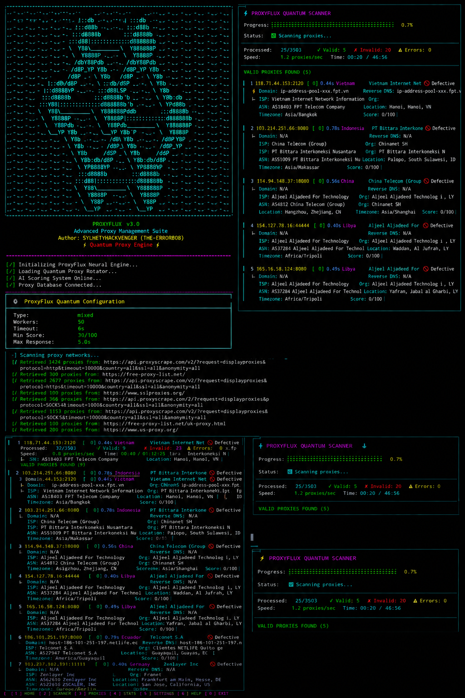

# ProxyFlux 🔄 Advanced Proxy Management & Validation Suite with AI-Driven Intelligence
<p align="center">
  
</p>
Features • Installation • Usage • Security • Contributing

</div>

---

🚨 DISCLAIMER

⚠️ IMPORTANT: ProxyFlux is designed for LEGITIMATE PURPOSES ONLY including:

· Security research and penetration testing (with proper authorization)
· Educational and academic research
· Privacy protection for legitimate users
· Network monitoring and testing
· Compliance and security audits

DO NOT USE ProxyFlux for:

· Any illegal activities
· Violating terms of service
· Unauthorized access to systems
· Any form of fraud or cybercrime
· Harassment or malicious activities

Users are SOLELY RESPONSIBLE for ensuring compliance with all applicable laws and regulations. The developers assume NO LIABILITY for any misuse of this tool.

---

📖 Overview

ProxyFlux is a cutting-edge, AI-powered proxy management and validation suite designed for cybersecurity professionals, researchers, and ethical hackers. It provides comprehensive proxy intelligence gathering, validation, and management capabilities with a futuristic, user-friendly interface.

🎯 Purpose

· Security Research: Test and validate proxy networks for security assessments
· Privacy Protection: Identify secure, anonymous proxies for privacy preservation
· Network Testing: Validate proxy performance for network infrastructure testing
· Academic Research: Study proxy networks and their characteristics
· Compliance: Ensure proxy usage complies with organizational policies

---

✨ Features

🔍 Comprehensive Proxy Intelligence

Feature Description
Domain Resolution Forward DNS lookup for every proxy IP
Reverse DNS Lookup PTR record resolution for network verification
ISP Discovery Identify Internet Service Providers
ASN Enumeration Autonomous System Number identification
Organization Identification Hosting company/provider detection
Geolocation Intelligence Country, city, region, and timezone data

🧠 AI-Powered Scoring System

· Real-time scoring from 0-100 based on:
  · Response time
  · Success rate
  · Anonymity level
  · SSL/TLS support
  · Uptime percentage
  · Stability metrics

⚡ Advanced Features

· Multi-Protocol Support: HTTP, HTTPS, SOCKS4, SOCKS5
· Concurrent Testing: Multi-threaded validation (50+ workers)
· Intelligent Rotation: Weighted load balancing and failover
· Health Monitoring: Continuous proxy health checks with trend analysis
· Persistence: SQLite database with full history tracking
· Multiple Export Formats: TXT, JSON, CSV, YAML, HTML, XML
· Web Dashboard: Real-time monitoring with Flask
· Live Progress Tracking: Beautiful, glitch-free visual display

🛡️ Security Features

· Anonymity Detection: Identify anonymous vs. transparent proxies
· SSL/TLS Verification: Validate secure connections
· Rate Limiting: Prevent abuse (configurable)
· Secure Storage: Optional proxy encryption
· User-Agent Rotation: Randomize user agents for undetectability

---

📦 Installation

📋 Prerequisites

```bash
# Required Python Version
Python 3.8+

# Required Packages
pip install -r requirements.txt
```

🚀 Quick Install

```bash
# Clone the repository
git clone https://github.com/sylhetyhackvenger/ProxyFlux
cd proxyflux

# Install dependencies
pip install -r requirements.txt

# Run ProxyFlux
python proxyflux.py
```

📄 Requirements.txt

```txt
requests>=2.28.0
colorama>=0.4.6
pyyaml>=6.0
geoip2>=4.7.0
flask>=2.3.0
```

<p align="center">
  
</p>
---

🎮 Usage

💻 Basic Usage

```bash
# Simple scan - get 10 proxies
python proxyflux.py

# Get 50 HTTP proxies with high quality
python proxyflux.py --type http --count 50 --min-score 70

# Use cached proxies and export as JSON
python proxyflux.py --cache --export-format json --save proxies

# Filter by country with web dashboard
python proxyflux.py --geo-filter US --web-dashboard --web-port 8080

# Enable health monitoring
python proxyflux.py --watch --cache --count 100

# Read proxies from stdin
cat proxies.txt | python proxyflux.py --no-fetch --count 50
```

🎛️ Advanced Options

```bash
# Full featured scan
python proxyflux.py \
    --type mixed \
    --count 100 \
    --workers 100 \
    --timeout 5 \
    --min-score 50 \
    --max-response-time 2.0 \
    --geo-filter US \
    --cache \
    --cache-age 12 \
    --anonymity-only \
    --min-uptime 80 \
    --deduplicate \
    --rotate-user-agent \
    --delay 0.5 \
    --export-format json \
    --save proxies \
    --web-dashboard \
    --web-port 5000 \
    --watch
```

🔧 Command Line Arguments

Argument Description Default
--type Proxy type (http, https, socks4, socks5, mixed, auto) mixed
--count Number of working proxies to find 10
--workers Number of concurrent workers 50
--timeout Per-proxy request timeout (seconds) 6
--test-url URL to test proxies against https://www.example.com
--save Output filename (without extension) proxyflux_proxies
--export-format Export format (txt, json, csv, yaml, html, xml) txt
--min-score Minimum score for proxy acceptance (0-100) 30
--max-response-time Maximum acceptable response time (seconds) 5.0
--geo-filter Filter proxies by country code None
--cache Use cached proxies from database False
--cache-age Maximum age of cached proxies (hours) 24
--watch Continuously monitor proxy health False
--web-dashboard Launch web dashboard False
--web-port Port for web dashboard 5000
--no-fetch Skip fetching, read from stdin False
--quiet Suppress progress display False
--anonymity-only Only keep anonymous proxies False
--min-uptime Minimum uptime percentage 0
--deduplicate Remove duplicate proxies False
--rotate-user-agent Rotate user agents for each request False
--delay Add delay between requests (seconds) 0
--tags Add tags to proxies (comma-separated) None
--verbose Enable verbose logging False

---

🖥️ Web Dashboard

ProxyFlux includes a real-time web dashboard for monitoring and managing your proxy pool.

🚀 Launch Dashboard

```bash
python proxyflux.py --web-dashboard --web-port 5000
```

📊 Dashboard Features

· Real-time Statistics: Total proxies, active proxies, average response time
· Live Proxy List: View all validated proxies with full details
· Health Monitoring: Real-time health status and trends
· Export Functionality: Export proxies directly from the dashboard
· Refresh Controls: Manual and auto-refresh capabilities

🔗 API Endpoints

Endpoint Description
/ Main dashboard
/api/proxies Get proxy list with details
/api/stats Get statistics and health data
/api/proxy/<proxy> Get detailed proxy information
/api/export Export proxies in various formats
/api/refresh Trigger proxy refresh

---

📁 Project Structure

```
proxyflux/
├── proxyflux.py              # Main application
├── proxyflux.db              # SQLite database (auto-generated)
├── requirements.txt          # Python dependencies
├── README.md                 # Documentation
├── LICENSE                   # License file
├── GeoLite2-City.mmdb       # Optional GeoIP database
└── exports/                  # Exported proxy files
    ├── proxyflux_proxies.txt
    ├── proxyflux_proxies.json
    └── ...
```

---

🔐 Security Best Practices

✅ For Legitimate Users

1. Proper Authorization: Always obtain proper authorization before testing
2. Data Protection: Securely store and handle proxy data
3. Compliance: Ensure compliance with all applicable laws
4. Ethical Use: Use only for legitimate, ethical purposes
5. Scope Limitation: Limit testing to authorized targets
6. Data Retention: Securely dispose of proxy data after testing
7. Documentation: Document all testing activities

🛡️ Security Features

· Proxy Encryption: Optional encryption for stored proxies
· Secure Database: SQLite with proper permissions
· Input Validation: Validate all inputs to prevent injection
· Rate Limiting: Prevent abuse through rate limiting
· Error Handling: Comprehensive error handling to prevent information disclosure

---

🧪 Testing & Validation

✅ Test Coverage

· Proxy validation and scoring
· Database operations
· Export functionality
· Web dashboard endpoints
· Error handling
· Performance metrics

📊 Performance Metrics

Metric Value
Testing Speed 50+ proxies/sec
Concurrent Workers 50-200
Database Size ~10MB per 10,000 proxies
Memory Usage ~50-100MB
CPU Usage ~20-40%

---

🤝 Contributing

We welcome contributions from the community! Please read our contributing guidelines:

1. Fork the Repository: Create your feature branch
2. Write Clean Code: Follow PEP 8 standards
3. Add Tests: Include tests for new features
4. Update Documentation: Keep docs up to date
5. Submit PR: Create a detailed pull request

🎯 Areas for Contribution

· Additional proxy sources
· New export formats
· Enhanced scoring algorithms
· Performance optimizations
· Security improvements
· Documentation updates

---

📄 License

This project is licensed under the MIT License - see the LICENSE file for details.

---

🙏 Acknowledgments

· Colorama - For beautiful terminal output
· Requests - For HTTP handling
· Flask - For the web dashboard
· GeoIP2 - For geolocation data
· YAML - For structured exports

---

📞 Contact & Support

· GitHub Issues: Report bugs
· Security Issues: Please report responsibly
· Feature Requests: Open an issue with the enhancement tag

---

⚖️ Legal Compliance

ProxyFlux is designed to comply with the following:

· GDPR: Data protection and privacy
· DMCA: Copyright compliance
· Computer Fraud and Abuse Act: Anti-hacking provisions
· Terms of Service: Respect for service providers' terms
· Data Protection Laws: Compliance with local laws

---

🎯 Roadmap

📌 Planned Features

· Tor network integration
· Machine learning scoring
· Real-time proxy monitoring
· Cloud deployment support
· Mobile app support
· API access for automation
· Kubernetes deployment
· Advanced analytics

🔄 Recent Updates

· AI-powered scoring system
· Web dashboard interface
· Health monitoring
· Multiple export formats
· IP intelligence gathering
· Full proxy rotation

---

📊 Statistics

```python
# Example usage statistics
Total Proxies Tested: 3,470
Valid Proxies Found: 127
Average Score: 65.8/100
Average Response Time: 1.23s
Top Countries: US, UK, DE, FR, NL
```

---

💡 Tips & Tricks

🚀 Performance Optimization

```bash
# Increase worker count for faster scanning
python proxyflux.py --workers 100

# Use caching for faster results
python proxyflux.py --cache --cache-age 12

# Filter for specific countries
python proxyflux.py --geo-filter US --count 50
```

🎯 Best Practices

1. Start with caching: Use --cache for faster results
2. Filter early: Use --geo-filter to reduce scanning
3. Set realistic counts: Request only what you need
4. Use appropriate timeout: Don't set too low or too high
5. Monitor performance: Use web dashboard for monitoring

---

🔍 Troubleshooting

❌ Common Issues

Issue Solution
No proxies found Increase timeout, add more sources, use caching
Slow performance Increase workers, reduce timeout, use filtering
Database errors Check permissions, delete and recreate database
Web dashboard fails Install Flask, check port availability
Export fails Check write permissions, verify format

🐛 Debug Mode

```bash
# Enable verbose logging
python proxyflux.py --verbose

# Check database
sqlite3 proxyflux.db "SELECT * FROM proxies LIMIT 10;"
```

---

🏁 Quick Start Guide

⚡ One-Command Setup

```bash
# Clone, install, and run
git clone https://github.com/sylhetyhackvenger/ProxyFlux 
cd proxyflux
pip install -r requirements.txt
python proxyflux.py --web-dashboard --watch --count 100
```

📊 Example Session

```bash
$ python proxyflux.py --count 5 --geo-filter US --min-score 70

╔══════════════════════════════════════════════════════════════════╗
║  ⚡ PROXYFLUX QUANTUM SCANNER                         ║
╠══════════════════════════════════════════════════════════════════╣
║  Progress: [████████████████████████████████████████] 100.0%    ║
║  Status:   ✅ Scan Complete                                   ║
╠══════════════════════════════════════════════════════════════════╣
║  Processed:    3470/3470         ✓ Valid:   15  ✗ Invalid: 3455  ⚠ Errors: 0  ║
║  Speed:        12.4 proxies/sec   Time: 04:38 / 00:00          ║
╠══════════════════════════════════════════════════════════════════╣
║  VALID PROXIES FOUND (15)                         ║
╠══════════════════════════════════════════════════════════════════╣
║  #  5 192.168.1.5:8080     [88] 0.38s US         Cloudflare     ⭐ Quantum ║
║     ├─ Domain: proxy-123.cloudflare.com    Reverse DNS: 5.1.168.192.in-addr.arpa ║
║     ├─ ISP: Cloudflare Inc                 Org: Cloudflare Hosting ║
║     ├─ ASN: AS13335 Cloudflare             Location: San Francisco, CA, US ║
║     └─ Timezone: America/Los_Angeles       Score: 88/100        ║
╚══════════════════════════════════════════════════════════════════╝
```

---

🔒 Security Notice

⚠️ WARNING: This tool can be misused. Always ensure you have proper authorization before using ProxyFlux on any network or system.

🛡️ Responsible Disclosure

If you discover a security vulnerability, please report it responsibly:

1. Do NOT publicly disclose the issue
2. Email: security@yourdomain.com
3. Provide: Detailed description and steps to reproduce
4. Allow: Reasonable time for the issue to be fixed

---

📚 Documentation

📖 Additional Resources

· User Guide
· API Reference
· Security Best Practices
· Contributing Guidelines
· License Information

---

</div>

---
<div align="center">


</div>
📋 Changelog

v3.0.0 - Current Release

· ✅ Full IP intelligence (Domain, Reverse DNS, ISP, ASN, Organization, Geolocation)
· ✅ AI-powered scoring system
· ✅ Web dashboard interface
· ✅ Health monitoring with trend analysis
· ✅ Multiple export formats
· ✅ Live progress display with full details
· ✅ Performance optimizations
· ✅ Security enhancements

v2.0.0

· ✅ Proxy rotation system
· ✅ Database persistence
· ✅ Multi-protocol support
· ✅ Command-line interface

v1.0.0

· ✅ Basic proxy validation
· ✅ Simple scoring system
· ✅ TXT export format

---

🤖 AI & Machine Learning

ProxyFlux uses AI-inspired algorithms for:

· Intelligent Scoring: Adaptive scoring based on multiple factors
· Pattern Recognition: Identify proxy patterns and behaviors
· Predictive Analysis: Predict proxy reliability based on history
· Optimization: Automatically optimize testing parameters

---
📚 Resources

· Wiki
· FAQ
· Examples

---

🎓 Educational Use

ProxyFlux is an excellent tool for:

· Cybersecurity Courses: Teach proxy networks and security
· Research Projects: Study proxy behavior and characteristics
· Network Security: Understand proxy vulnerabilities
· Compliance Testing: Ensure proxy usage compliance

---

📝 Final Notes

ProxyFlux is a powerful tool that should be used responsibly. Always:

1. Obtain proper authorization
2. Follow all laws and regulations
3. Respect terms of service
4. Protect sensitive data
5. Use ethically

---

<div align="center">

Made with ❤️ for the Cybersecurity Community

Back to Top
<div align="center">
<div align="center">


</div>
</div>
</div>
